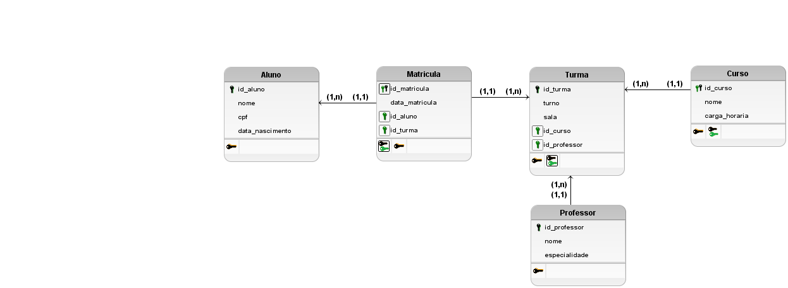

# 📊 Modelo ER - Escola de Idiomas

Modelo entidade-relacionamento desenvolvido no brModelo.

## 📌 Entidades

* Aluno
* Professor
* Turma
* Curso
* Matrícula

## 🔗 Relacionamentos

* Aluno realiza Matrícula
* Matrícula pertence a uma Turma
* Turma pertence a um Curso
* Professor leciona Turma

## 🖼️ Diagrama

## 📁 Arquivos

* diagrama_escola.png
* diagrama_escola.brM3
